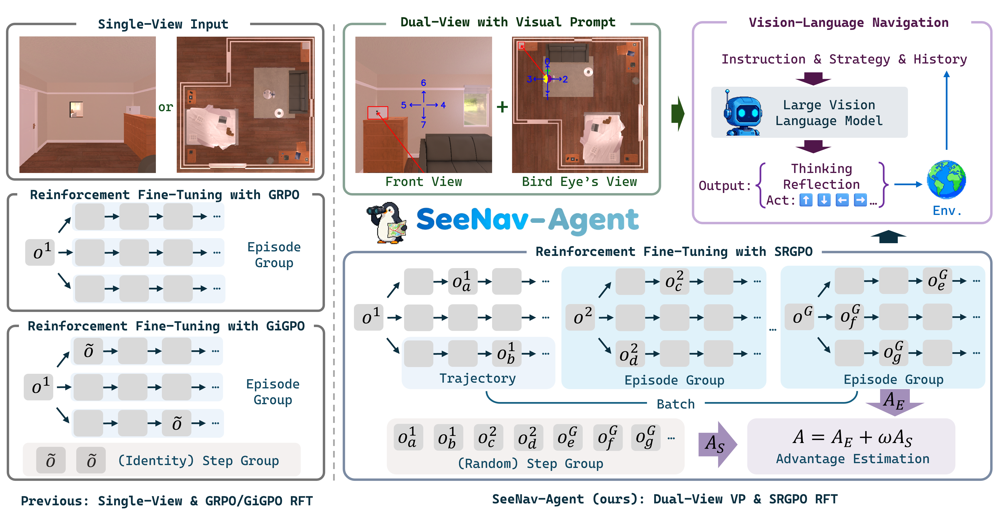
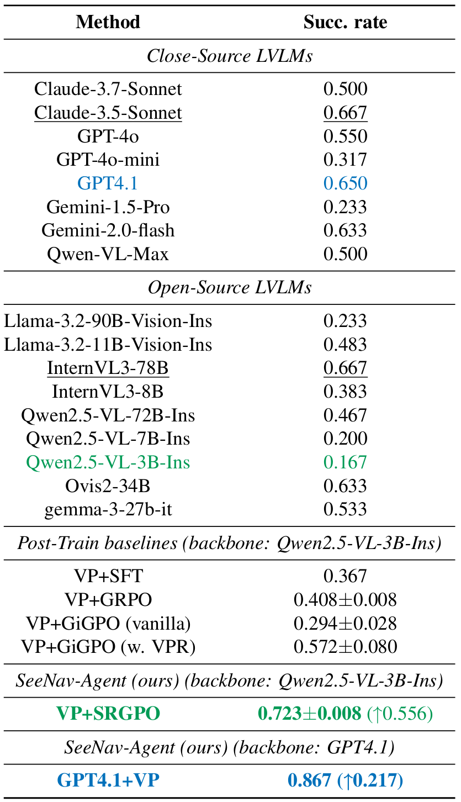
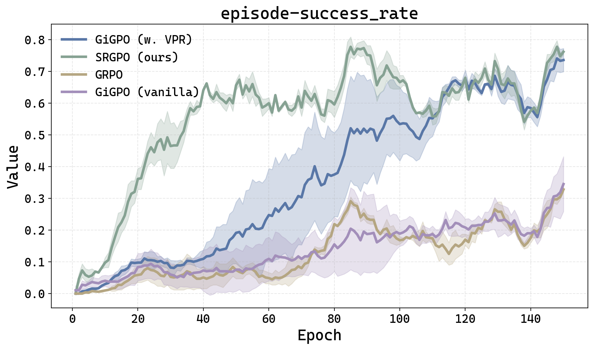
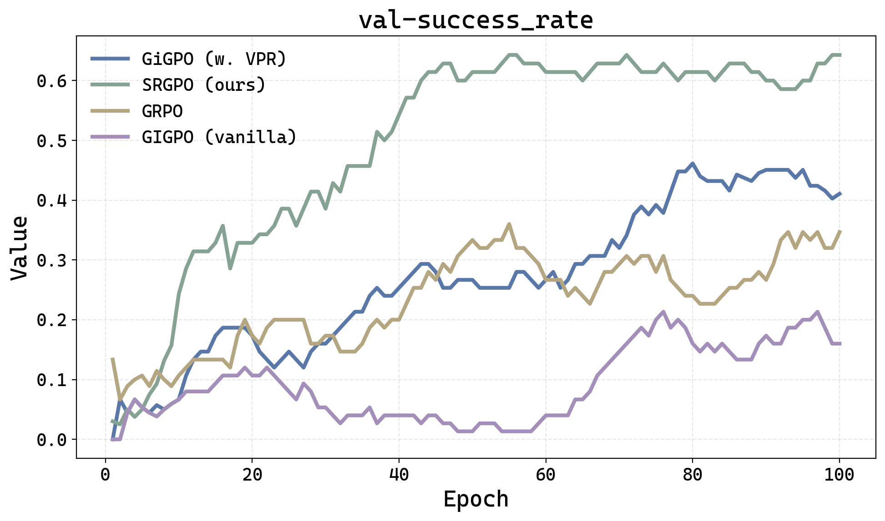

#  SeeNav-Agent: Enhancing Vision-Language Navigation with Visual Prompt and Step-Level Policy Optimization

[](https://arxiv.org/abs/xxxxxxxx)
[](https://huggingface.co/wangzc9865/SeeNav-Agent)

We propose [**SeeNav-Agent**](https://arxiv.org/abs/xxxxxxxx), a novel LVLM-based embodied navigation framework that includes a zero-shot dual-view visual prompt technique for the input side and an efficient RFT algorithm named SRGPO for post-training.

**🔥 Updates**

- [x] **2025/12/5**: Release our paper and model checkpoints.

## 🚀 Highlights

* 🚫 **Zero-Shot Visual Prompt:** No extra training for performance improvement with visual prompt.

* 🗲 **Efficient Step-Level Advantage Calculation:** Step-Level groups are randomly sampled from the entire batch.

* 📈 **Significant Gains:** +21.7pp (GPT4.1+VP) and +5.6pp (Qwen2.5-VL-3B+VP+SRGPO) improvements on EmbodiedBench-Navigation.

## 📖 Summary
<div style="text-align: center;">
  
</div>

* 🎨 **Dual-View Visual Prompt:** We apply visual prompt techniques directly on the input dual-view image to reduce the visual hallucination.

* 🔁 **Step Reward Group Policy Optimization (SRGPO):** By defining a state-independent verifiable process reward function, we achieve efficient step-level random grouping and advantage estimation.


## 📋 Results on EmbodiedBench-Navigation

### 📝 Main Results
<div align="center">
    
</div>

### 🖌️ Training Curves for RFT
<div align="center">
    
</div>

### 🖍️ Testing Curves for OOD-Scenes
<div align="center">
    
</div>

### 📦 Checkpoint

| base model | env | 🤗 link |
| :--: | :--: | :--: |
| Qwen2.5-VL-3B-Instruct-SRGPO| EmbodiedBench-Nav | [Qwen2.5-VL-3B-Instruct-SRGPO](https://huggingface.co/wangzc9865/SeeNav-Agent) |

## 🛠️ Usage

### Setup

1. Setup a seperate environment for evaluation according to: [EmbodiedBench-Nav](https://github.com/langfengQ/verl-agent) and [Qwen3-VL](https://github.com/QwenLM/Qwen3-VL) to support Qwen2.5-VL-Ins.

2. Setup a seperate training environment according to: [verl-agent]([./osworld/README.md](https://github.com/langfengQ/verl-agent)) and [Qwen3-VL](https://github.com/QwenLM/Qwen3-VL) to support Qwen2.5-VL-Ins.

### Evaluation

Use the following command to evaluate the model on EmbodiedBench:

```bash
conda activate <your_env_for_eval>
cd SeeNav
python testEBNav.py
```

Hint: you need to first set your endpoint, API-key and api_version in [`SeeNav/planner/models/remote_model.py`](./SeeNav/planner/models/remote_model.py)

### Training

[`verl-agent/examples/srgpo_trainer`](./verl-agent/examples/srgpo_trainer) contains example scripts for SRGPO-based training on EmbodiedBench-Navigation.

1. Modify [`run_ebnav.sh`](./verl-agent/examples/srgpo_trainer/run_ebnav.sh) according to your setup.

2. Run the following command:

```bash
bash verl-agent/examples/srgpo_trainer/run_ebnav.sh
```

## 📚 Citation

If you find this work helpful in your research, please consider citing:

```bibtex
@article{wang2025seenav,
  title={SeeNav-Agent: Enhancing Vision-Language Navigation with Visual Prompt and Step-Level Policy Optimization},
  author={Zhengcheng Wang and Zichuan Lin and Yijun Yang and Haobo Fu and Deheng Ye},
  journal={arXiv preprint arXiv:xxxxxxxx},
  year={2025}
}
```

## Acknowledgements
Our code is built with reference to the code of the following projects: [verl-agent](https://github.com/langfengQ/verl-agent) and [EmbodiedBench](https://embodiedbench.github.io/).